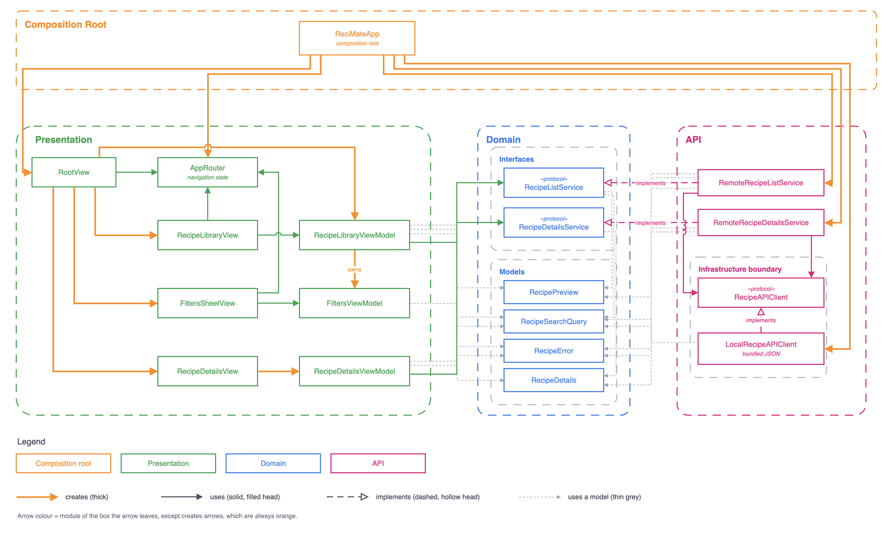
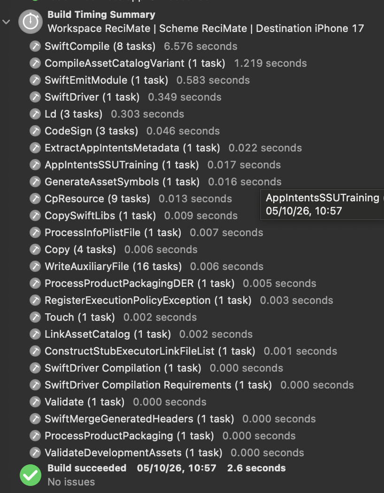
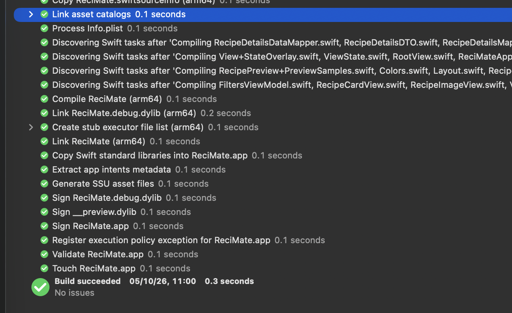

# ReciMate 🍋👨‍🍳 — Your recipe companion

[](https://github.com/igdutra/recimate/actions/workflows/ci.yml)

ReciMate is a native iOS recipe browser built with Swift and SwiftUI. It loads recipes from a local JSON mock API and lets you search titles and cooking steps, and filter by vegetarian, servings, and ingredients to include or exclude. Built with MVVM, clear layer boundaries and explicit loading, error and no-results states.

<p align="center">
  
</p>


## Setup

1. Open `ReciMate.xcodeproj` in Xcode 26 (built with 26.5).
2. Pick the `ReciMate` scheme and an iOS 26 simulator (developed on iPhone 17), then Run (⌘R). No packages to resolve and no network needed: the data ships in the app bundle.
3. Run the tests with ⌘U, or from the terminal with `scripts/test.sh` (one suite: `scripts/test.sh ReciMateTests/<Suite>`; needs [ripgrep](https://github.com/BurntSushi/ripgrep), `brew install ripgrep`). 140 Swift Testing tests cover the domain, the API layer and every view model.

`scripts/test.sh` wraps `xcodebuild` because running it raw, often, works badly for an AI agent and for the person watching:

- **It floods the context.** `xcodebuild` prints thousands of lines. The script keeps them in `build/build.log` and `build/test.log` and prints only the test results, then `PASS` or `FAILED` with the failing lines.
- **It goes quiet for minutes.** The script prints a `tail -F` line first, so the build and the tests can be watched live from another terminal.
- **It is slow to give feedback.** The script builds with `build-for-testing` (a quick no-op when nothing changed) and runs with `test-without-building` on the already booted simulator, with parallel testing off so Xcode does not clone the simulator. A run takes seconds instead of about 40.
- **A scope that matches nothing looks like success.** The script counts the tests that ran and fails on zero.

Two recipes fail on purpose when opened, so the error handling can be seen in the app. Their titles say so:

- **Creamy Tomato Pasta (Fails: Data)**: its detail file is malformed (`invalidData`).
- **Beef Tacos (Fails: Not Found)**: it has no detail file (`notFound`).

Both show the recoverable error screen with Try Again.

No Swift Packages are used; the app needs only the system frameworks.

## Architecture overview



- Three modules: `Presentation`, `Domain` and `API`. `Presentation` and `API` never see each other; both depend on `Domain` only.
- `ReciMateApp`, the composition root, is the one place that builds `API` types; it forwards them as Domain protocols to the views, and each view creates the view model it owns.
- Inside `API`, the services reach their data only through `RecipeAPIClient`, which knows nothing about recipes.
- The three live in one app target on purpose: at this size, separate targets would add setup without adding safety.
- Because no module reaches into another, each can be split into its own framework or Swift package with little more than moving files.

The diagram is a dependency diagram drawn from the code itself: every arrow is a type that creates, owns, implements or uses another. Its Mermaid source is in [`docs/architecture.md`](docs/architecture.md).

### Clean Architecture, sized to the app

A full Clean Architecture stack has a layer for each job:

```
Infrastructure → Data Source → Repository → Use Case → View Model → View
  bytes            DTO           domain       rules       view data
```

ReciMate gets the same isolation with fewer layers:

```
RecipeAPIClient → RemoteRecipeListService → RecipeLibraryViewModel → RecipeLibraryView
  bytes             DTO → domain              view data
```

Each layer sits behind a protocol, so everything below the views can be unit tested on its own, with only the layers this app needs. The data source and repository are one service, and there are no use cases because there is no business rule to hold yet. A second data source or a real rule would bring those layers back. There is no silver-bullet architecture, only the right size for the case.

### Swapping the mock for a real network

The app was built with mockability in mind, so swapping the local data for a real backend is a small change. Today, `LocalRecipeAPIClient` conforms to `RecipeAPIClient` (`func data(from url: URL) async throws -> Data`) and answers each URL from the bundled JSON. A real backend needs only an HTTP client that conforms to the same protocol, fetches the endpoint's URL with `URLSession` and returns the bytes (mapping a 404 to `RecipeAPIClientError.notFound`). The only other change is in `ReciMateApp`, where `LocalRecipeAPIClient()` becomes the new client. The endpoints, DTOs, mappers, services, view models and views stay as they are.

## API design

The app talks to a modeled REST API with two endpoints. A search is a list with filters, so it has no endpoint of its own.

| Endpoint | Returns |
|---|---|
| `GET /recipes` | Recipe previews (id, title, description, servings, vegetarian, image). With no filters, every recipe. |
| `GET /recipes/{id}` | One recipe in full, adding ingredients with quantities and numbered steps. |

Every filter on `GET /recipes` is optional, and filters combine with AND:

| Parameter | Meaning |
|---|---|
| `vegetarian=true` | Vegetarian recipes only. Left out, no filter. |
| `servings=<n>` | Exactly `n` servings. |
| `include=<term>` (repeatable) | Has an ingredient containing every term. |
| `exclude=<term>` (repeatable) | Has no ingredient containing any term. |
| `instructions=<text>` | Some cooking step contains the text. |
| `q=<text>` | The title or some cooking step contains the text; title matches come first. The search field uses this one. |

For example, vegetarian recipes for four, with chocolate and butter, no nuts, and "ramekins" in the title or steps:

```
GET /recipes?vegetarian=true&servings=4&include=chocolate&include=butter&exclude=nuts&q=ramekins
```

```json
[
  {
    "id": "petit-gateau",
    "title": "Petit Gâteau",
    "description": "Brazilian-style warm chocolate cake with a molten center, served with vanilla ice cream.",
    "servings": 4,
    "dietary_attributes": { "is_vegetarian": true },
    "image_url": "https://static.itdg.com.br/images/640-400/9654b1eb43fdd1aec9e88267cb3f90a3/243868-original.jpg"
  }
]
```

Tapping it calls `GET /recipes/petit-gateau`. A missing recipe (a 404) becomes `RecipeError.notFound` and a response that does not decode becomes `RecipeError.invalidData`. Each gets its own message on the error screen, with Try Again.

The response shapes live in the API layer as DTOs (`RecipePreviewDTO`, `RecipeDetailsDTO`) and are mapped into plain domain types, so a change in the JSON stays inside `API`. Here, `LocalRecipeSearchServer` plays the server: it reads these URLs, filters the bundled catalog and answers with the same JSON.

## Architecture decisions

Seven choices made on purpose. The reasoning, the rejected options and the rest of the list are in [`docs/decisions.md`](docs/decisions.md).

- **Strict Swift 6 concurrency, no escape hatches**
  - The app builds in Swift 6 language mode, where the compiler rejects any possible data race, and nothing switches that check off: no `@unchecked Sendable`, `nonisolated(unsafe)` or `@preconcurrency`.
  - View models run on the main actor; each service reads and decodes its JSON in one `@concurrent` method, off the main actor, so parsing never blocks the UI.
- **One search field for titles and steps**
  - No scope picker, following Apple's HIG and NN/g; a card found only by its steps says so. Typing is debounced, and a stale reply never overwrites a newer one.
- **The view state does not carry the data**
  - `ViewState` (`loading`, `loaded`, `error`) sits beside the data, so the grid keeps its cards and scroll position while a new search runs.
- **Views navigate through an injected router**
  - `AppRouter` is created at the composition root and passed to the views by initializer, never through `@Environment`. The views call it directly, which keeps navigation out of the view models.
- **Backend data is trusted, not validated**
  - `invalidData` means only "does not decode": rule checks were built, then removed, because they hid what the server sent. Each error kind gets its own message and Try Again.
- **Native controls first**
  - `.searchable`, `ContentUnavailableView`, a `Form` sheet, a segmented `Picker` and the system back button: iOS 26 draws them in its own style, and none is rebuilt by hand.
- **Views get finished view data**
  - `Equatable`, already formatted and written only by the view model, built once per load by a static mapper, so views hold no logic and SwiftUI skips unchanged cards.


## Assumptions and limitations

- **Matching** ignores case and accents and uses "contains"; include terms must all match, any exclude term drops a recipe, and the same term in both returns nothing.
- **Bad data is an error, not an empty screen:** a broken or missing detail shows Try Again; missing photos or quantities are valid.
- **The mock waits one second** on every request, so the loading state can be seen.
- **The search cache** is a plain in-memory dictionary, with no expiry or size limit.
- **Not built yet:** dark mode, an accessibility pass and view tests (see [`product/BACKLOG.md`](product/BACKLOG.md)).

The full list: [`docs/assumptions-and-limitations.md`](docs/assumptions-and-limitations.md).

## Code organization

- One folder per layer: `API/`, `Domain/`, `Presentation/`, and `ReciMateApp.swift` as the composition root.
- A screen's view data and small row views live in the view's file; the domain-to-view-data mapping is a static function on its view model, tested with it.
- Fewer, fuller files on purpose: at this size they read more easily. A bigger team or a shared mapper would earn its own file.

## AI workflow

The repo carries a set of Claude Code skills under [`.claude/skills`](.claude/skills), a spec-driven workflow for working with an AI agent:

```
/discovery → /prototype → /spec → /implement-spec → /qa + /local-code-review → /finish
```

`/pitch` is a separate skill for writing up a finished piece of work. Each task gets a slug (`NNN-short-kebab-slug`, fixed by `/discovery`), and its work lands in `specs/<slug>/`. The milestones it worked through are in [`product/`](product/).

The workflow follows Anthropic's guidance for the Claude 5 family. The core idea comes from [A field guide to Claude Fable: finding your unknowns](https://claude.com/blog/a-field-guide-to-claude-fable-finding-your-unknowns): the quality of the work is bottlenecked by how well its unknowns are clarified, so each practice in it (blind-spot interviews, prototyping several directions, implementation plans, implementation notes, explainers, pitches) became one skill. Further refinements come from:

- [Getting the most out of Opus 5.5](https://claude.dev/blog/getting-the-most-out-of-opus-5-5/)
- [Building with Claude Sonnet 5.5](https://claude.dev/blog/building-with-claude-sonnet-5-5/)
- [Spending Your Effort](https://claude.dev/blog/spending-your-effort/)

Build and test commands for the agent live in [`CLAUDE.md`](CLAUDE.md).

## Build

A clean build takes 2.6 seconds and an incremental build 0.3 seconds[^build-summary] (Xcode 26.5, iPhone 17 simulator). The layers meet only at protocols, which keeps changes local and the project quick to build.

<p>
  
  
</p>

[^build-summary]: In Xcode's Build Timing Summary, each line adds up the time of every task of that kind, and tasks run in parallel on several cores. So the 8 `SwiftCompile` tasks add up to 6.6 seconds of work inside a build that took 2.6 seconds on the clock. The total at the bottom is the real time.
