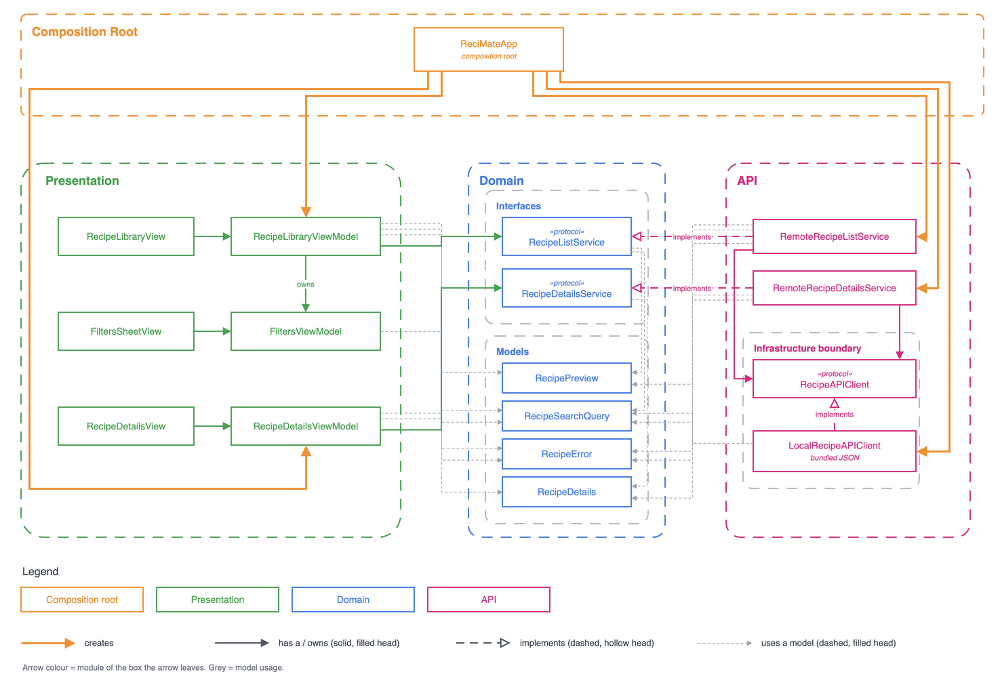

# ReciMate 🍋👨‍🍳 — Your recipe companion

ReciMate is a native iOS recipe browser built with Swift and SwiftUI. It loads recipes from a local JSON mock API and lets you search titles and cooking steps, and filter by vegetarian, servings, and ingredients to include or exclude. Built with MVVM, clear layer boundaries and explicit loading, error and no-results states.

<p align="center">
  
</p>


## Setup

1. Open `ReciMate.xcodeproj` in Xcode 26 (built with 26.5).
2. Pick the `ReciMate` scheme and an iOS 26 simulator (developed on iPhone 17), then Run (⌘R). No packages to resolve and no network needed: the data ships in the app bundle.
3. Run the tests with ⌘U, or from the terminal with `scripts/test.sh` (one suite: `scripts/test.sh ReciMateTests/<Suite>`; needs [ripgrep](https://github.com/BurntSushi/ripgrep), `brew install ripgrep`). 140 Swift Testing tests cover the domain, the API layer and every view model.

`scripts/test.sh` wraps `xcodebuild` because running it raw, often, works badly for an AI agent and for the person watching:

- **It floods the context.** `xcodebuild` prints thousands of lines. The script keeps them in `build/build.log` and `build/test.log` and prints only the test results, then `PASS` or `FAILED` with the failing lines.
- **It goes quiet for minutes.** The script prints a `tail -F` line first, so the build and the tests can be watched live from another terminal.
- **It is slow to give feedback.** The script builds with `build-for-testing` (a quick no-op when nothing changed) and runs with `test-without-building` on the already booted simulator, with parallel testing off so Xcode does not clone the simulator. A run takes seconds instead of about 40.
- **A scope that matches nothing looks like success.** The script counts the tests that ran and fails on zero.

Two recipes fail on purpose when opened, so the error handling can be seen in the app. Their titles say so:

- **Creamy Tomato Pasta (Fails: Data)**: its detail file is malformed (`invalidData`).
- **Beef Tacos (Fails: Not Found)**: it has no detail file (`notFound`).

Both show the recoverable error screen with Try Again.

No Swift Packages are used; the app needs only the system frameworks.

## Architecture overview



- Three modules: `Presentation`, `Domain` and `API`. `Presentation` and `API` never see each other; both depend on `Domain` only.
- `ReciMateApp`, the composition root, is the one place that builds `API` types and hands them to the view models as Domain protocols.
- Inside `API`, the services reach their data only through `RecipeAPIClient`, which knows nothing about recipes.
- The three live in one app target on purpose: at this size, separate targets would add setup without adding safety.
- Because no module reaches into another, each can be split into its own framework or Swift package with little more than moving files.

The diagram is a dependency diagram drawn from the code itself: every arrow is a type that creates, owns, implements or uses another. Its Mermaid source is in [`docs/architecture.md`](docs/architecture.md).

### Swapping the mock for a real network

The app was built with mockability in mind, so swapping the local data for a real backend is a small change. Today, `LocalRecipeAPIClient` conforms to `RecipeAPIClient` (`func data(from url: URL) async throws -> Data`) and answers each URL from the bundled JSON. A real backend needs only an HTTP client that conforms to the same protocol, fetches the endpoint's URL with `URLSession` and returns the bytes (mapping a 404 to `RecipeAPIClientError.notFound`). The only other change is in `ReciMateApp`, where `LocalRecipeAPIClient()` becomes the new client. The endpoints, DTOs, mappers, services, view models and views stay as they are.

## API design

The app talks to a modeled REST API with two endpoints. A search is a list with filters, so it has no endpoint of its own.

| Endpoint | Returns |
|---|---|
| `GET /recipes` | Recipe previews (id, title, description, servings, vegetarian, image). With no filters, every recipe. |
| `GET /recipes/{id}` | One recipe in full, adding ingredients with quantities and numbered steps. |

Every filter on `GET /recipes` is optional, and filters combine with AND:

| Parameter | Meaning |
|---|---|
| `vegetarian=true` | Vegetarian recipes only. Left out, no filter. |
| `servings=<n>` | Exactly `n` servings. |
| `include=<term>` (repeatable) | Has an ingredient containing every term. |
| `exclude=<term>` (repeatable) | Has no ingredient containing any term. |
| `instructions=<text>` | Some cooking step contains the text. |
| `q=<text>` | The title or some cooking step contains the text; title matches come first. The search field uses this one. |

For example, vegetarian recipes for four, with chocolate and butter, no nuts, and "ramekins" in the title or steps:

```
GET /recipes?vegetarian=true&servings=4&include=chocolate&include=butter&exclude=nuts&q=ramekins
```

```json
[
  {
    "id": "petit-gateau",
    "title": "Petit Gâteau",
    "description": "Brazilian-style warm chocolate cake with a molten center, served with vanilla ice cream.",
    "servings": 4,
    "dietary_attributes": { "is_vegetarian": true },
    "image_url": "https://static.itdg.com.br/images/640-400/9654b1eb43fdd1aec9e88267cb3f90a3/243868-original.jpg"
  }
]
```

Tapping it calls `GET /recipes/petit-gateau`. A missing recipe (a 404) becomes `RecipeError.notFound` and a response that does not decode becomes `RecipeError.invalidData`. Each gets its own message on the error screen, with Try Again.

The response shapes live in the API layer as DTOs (`RecipePreviewDTO`, `RecipeDetailsDTO`) and are mapped into plain domain types, so a change in the JSON stays inside `API`. Here, `LocalRecipeSearchServer` plays the server: it reads these URLs, filters the bundled catalog and answers with the same JSON.

## Architecture decisions

The reasoning, the alternatives and when each would go the other way: [`docs/decisions.md`](docs/decisions.md).

- **Transport types stay out of the domain.** DTOs and mappers live in `API`; `Domain` holds plain types with no `Codable`, so the views never depend on the JSON's shape.
- **The view state does not carry the data.** `ViewState` is `loading`, `loaded` or `error`, and the data sits beside it, so the grid keeps its cards and scroll position while a new search runs.
- **Navigation goes through a router the views own.** `AppRouter` is injected at the composition root (never `@Environment`), which keeps navigation out of the view models.
- **One search field finds titles and steps.** Following Apple's HIG and NN/g, the field searches broadly with no scope picker, and a card found only by its steps says "Found in the steps".
- **Searches are debounced, cancelled and cached.** Typing waits 0.3 seconds, an older search never overwrites a newer one, and a query already seen shows its result at once.

## Assumptions and tradeoffs

- **Matching** ignores case and accents and uses "contains". Include terms must all match (AND); a recipe with any excluded term is dropped. Ingredients match by name.
- **Conflicting filters:** the same ingredient included and excluded returns nothing, not an error. The Filters sheet prevents it: adding a term to one list removes it from the other.
- **Empty input:** blank or whitespace-only text and terms are dropped before the request is built. Vegetarian off means no filter, never "non-vegetarian only". Servings is an exact match.
- **Malformed data:** a broken or missing detail is our data's fault, so it shows an error with Try Again, not an empty screen. Missing photos, quantities or steps are valid and are shown as absent.
- **Errors:** one message per error kind, worded to fit either screen. The decoder's technical reason is kept on the error for debugging, never shown.
- **"Found in the steps"** is decided in the app, because the card already has the title. A real backend with smarter matching (stemming, synonyms) would have to return where the match was.

Each spec's full list lives in `specs/<slug>/implementation-notes.md`.

## Known limitations

- The mock API waits one second on every request, to make the loading state visible.
- The search cache is a plain in-memory dictionary: no expiry, refresh, invalidation or size limit. Fine for static local data, not for a real backend ([details](docs/decisions.md#search-result-cache)).
- A `+` in a query value is not percent-encoded, so a real server could read it as a space.
- Search is one phrase: no multi-word matching, ranking beyond "titles first", or highlighting of the matching step.
- The servings picker offers 1 to 8; a backend with larger servings counts would need a different control.
- Light mode only; no accessibility pass, UI tests or snapshot tests yet. Navigation has no unit tests (planned with ViewInspector). These and other extras are in [`product/BACKLOG.md`](product/BACKLOG.md).

## Code organization

Files are condensed for simplicity. A view's view data lives in the view's file, and the mapping from a domain type to view data is a static function on the view model, tested with it. Under `Presentation/Library/`, a card's small views sit together in `Components/RecipeCard/`. The Details screen follows the same shape in `Presentation/Details/`: its view data types and small row views sit in `RecipeDetailsView.swift`, and the servings label shared with the Library is `Shared/ServingsLabelFormatter.swift`. Depending on the project, each of these types can deserve its own file (a bigger team, a larger view data type, a mapper shared by several screens); here, fewer files made the code easier to read.

## AI workflow

The repo carries a set of Claude Code skills under [`.claude/skills`](.claude/skills), a spec-driven workflow for working with an AI agent:

```
/discovery → /prototype → /spec → /implement-spec → /qa + /local-code-review → /finish
```

`/pitch` is a separate skill for writing up a finished piece of work. Each task gets a slug (`NNN-short-kebab-slug`, fixed by `/discovery`), and its work lands in `specs/<slug>/`. The milestones it worked through are in [`product/`](product/).

The workflow follows Anthropic's guidance for the Claude 5 family. The core idea comes from [A field guide to Claude Fable: finding your unknowns](https://claude.com/blog/a-field-guide-to-claude-fable-finding-your-unknowns): the quality of the work is bottlenecked by how well its unknowns are clarified, so each practice in it (blind-spot interviews, prototyping several directions, implementation plans, implementation notes, explainers, pitches) became one skill. Further refinements come from:

- [Getting the most out of Opus 5.5](https://claude.dev/blog/getting-the-most-out-of-opus-5-5/)
- [Building with Claude Sonnet 5.5](https://claude.dev/blog/building-with-claude-sonnet-5-5/)
- [Spending Your Effort](https://claude.dev/blog/spending-your-effort/)

Build and test commands for the agent live in [`CLAUDE.md`](CLAUDE.md).

## Build

A clean build takes 2.6 seconds and an incremental build 0.3 seconds[^build-summary] (Xcode 26.5, iPhone 17 simulator). The layers meet only at protocols, which keeps changes local and the project quick to build.

<p>
  
  
</p>

[^build-summary]: In Xcode's Build Timing Summary, each line adds up the time of every task of that kind, and tasks run in parallel on several cores. So the 8 `SwiftCompile` tasks add up to 6.6 seconds of work inside a build that took 2.6 seconds on the clock. The total at the bottom is the real time.
