# Architecture

Three modules: `API`, `Domain` and `Presentation`. `Presentation` and `API` never see each other; both depend on `Domain` only. `ReciMateApp`, the composition root, is the one place that builds `API` types; it forwards them as Domain interfaces to the views, and each view creates the view model it owns.

Inside `API`, the services reach their data source only through `RecipeAPIClient`, so the bundled-JSON `LocalRecipeAPIClient` can be swapped for a network client without touching a service.

Arrows: thick = creates, solid = uses, dotted = implements, thin grey = uses a model.

```mermaid
flowchart TB
    App["ReciMateApp<br/><i>composition root</i>"]

    subgraph Presentation
        direction LR
        Root[RootView]
        LibraryView[RecipeLibraryView]
        LibraryVM[RecipeLibraryViewModel]
        FiltersView[FiltersSheetView]
        FiltersVM[FiltersViewModel]
        DetailsView[RecipeDetailsView]
        DetailsVM[RecipeDetailsViewModel]
    end

    subgraph Domain
        subgraph Interfaces
            direction LR
            ListService{{"«protocol»<br/>RecipeListService"}}
            DetailsService{{"«protocol»<br/>RecipeDetailsService"}}
        end
        subgraph Models
            direction LR
            Preview[RecipePreview]
            Details[RecipeDetails]
            Query[RecipeSearchQuery]
            Error[RecipeError]
        end
    end

    subgraph API
        direction TB
        RemoteList[RemoteRecipeListService]
        RemoteDetails[RemoteRecipeDetailsService]
        subgraph Infrastructure["Infrastructure boundary"]
            APIClient{{"«protocol»<br/>RecipeAPIClient"}}
            LocalClient["LocalRecipeAPIClient<br/><i>bundled JSON</i>"]
        end
    end

    %% Creates (0-4, and 7)
    App ==> Root
    Root ==> LibraryVM
    App ==> RemoteList
    App ==> RemoteDetails
    App ==> LocalClient

    %% Presentation (5-10)
    LibraryView --> LibraryVM
    FiltersView --> FiltersVM
    DetailsView ==> DetailsVM
    LibraryVM -->|owns| FiltersVM
    LibraryVM --> ListService
    DetailsVM --> DetailsService

    %% API (11-15)
    RemoteList -.->|implements| ListService
    RemoteDetails -.->|implements| DetailsService
    RemoteList --> APIClient
    RemoteDetails --> APIClient
    LocalClient -.->|implements| APIClient

    %% Model usage (16-30)
    ListService --> Preview
    ListService --> Query
    DetailsService --> Details
    LibraryVM --> Preview
    LibraryVM --> Query
    LibraryVM --> Error
    FiltersVM --> Query
    DetailsVM --> Details
    DetailsVM --> Error
    RemoteList --> Preview
    RemoteList --> Query
    RemoteList --> Error
    RemoteDetails --> Details
    RemoteDetails --> Error
    LocalClient --> Query

    classDef root fill:#fde68a,stroke:#b45309,color:#1f2937
    classDef presentation fill:#dbeafe,stroke:#1d4ed8,color:#1f2937
    classDef protocol fill:#dcfce7,stroke:#15803d,color:#1f2937,stroke-width:2px
    classDef model fill:#f3f4f6,stroke:#6b7280,color:#1f2937
    classDef api fill:#fce7f3,stroke:#be185d,color:#1f2937

    class App root
    class Root,LibraryView,LibraryVM,FiltersView,FiltersVM,DetailsView,DetailsVM presentation
    class ListService,DetailsService,APIClient protocol
    class Preview,Details,Query,Error model
    class RemoteList,RemoteDetails,LocalClient api

    linkStyle 0,1,2,3,4,7 stroke:#b45309,stroke-width:2.5px
    linkStyle 16,17,18,19,20,21,22,23,24,25,26,27,28,29,30 stroke:#9ca3af,stroke-width:1px
```

